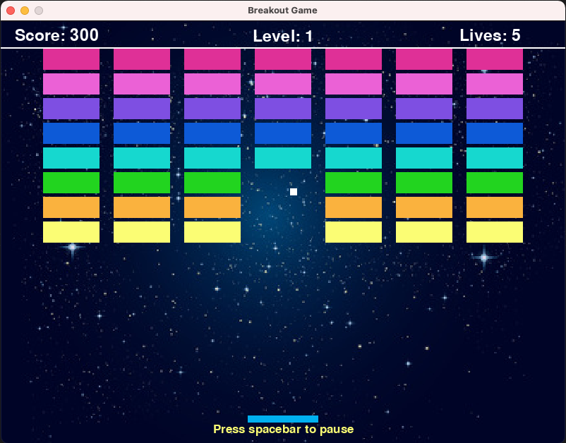

# BREAKOUT GAME

This is a simple implementation of the Breakout game. It has three levels of difficulty with increased speed in each of them.

For better UX sound effects and pause key were implemented.

To run this project locally, you will first need to install pygame (run --pip install pygame) and then type --python main.app.

Enjoy!